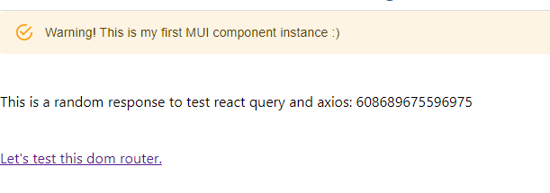
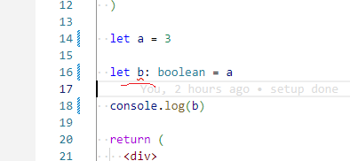

# 1. Setup IDE, node.js, nvm, basic app

## Install nvm and then node.js

1.1. install nvm
https://github.com/coreybutler/nvm-windows/releases/download/1.1.10/nvm-setup.exe

1.2 do `nvm install latest`

1.3 do `nvm use X.XX` where X.XX is the version you've installed

check:

```
C:\Users\mladen.tsvetkov>nvm list

  * 18.5.0 (Currently using 64-bit executable)
    16.7.0
    14.15.0
    12.0.0

C:\Users\mladen.tsvetkov>node -v
v18.5.0

C:\Users\mladen.tsvetkov>npm -v
8.12.1

C:\Users\mladen.tsvetkov>npx -v
8.12.1

C:\Users\mladen.tsvetkov>
```

## pull the code

```
git clone https://github.com/mladentsvetkov/rct-trn-jan-2022.git
git checkout [commit id for this lesson]
```

## install the app

Go to where package.json is. Do `npm i`.

## Check if app is ok

In the folder where package.json is, run `npm start`. The app should open on `localhost:3000`

You should see something like this



Make sure you see the MUI component, get a random response and when you click on the link another page opens.

## check if IDE is ok

Uncomment the following lines in the App.tsx file

```
  // let a = 3

  // let b: boolean = a

  // console.log(b)
```

Make sure typescript checks the wrong type assignmnet as per the image below:



The error in the problems tab in vs code should say `Type 'number' is not assignable to type 'boolean'.`

Check if prettier is working: type the following:

```
 const somevar    =    'blah'    ;
```

press ctrl + s

it should automatically format to

```
 const somevar = 'blah'
```